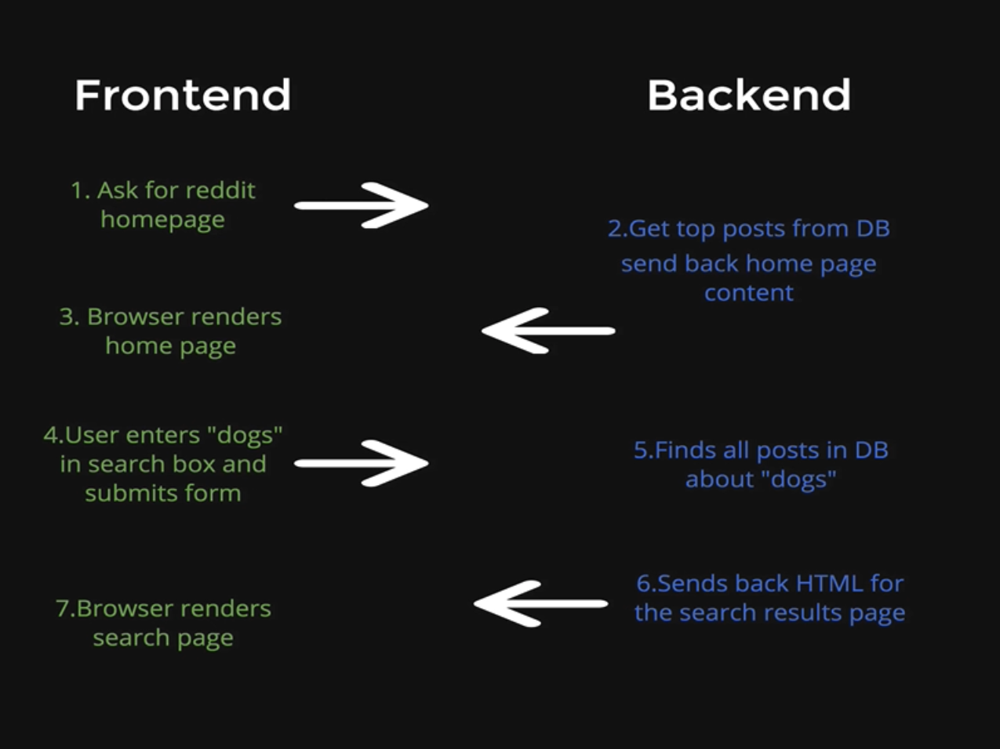

# Intro to Backend

- Review Internet Basics
- Static vs Dynamic Sites
- Stacks/Back End Technologies

## INTERNET BASICS

- When we go to an URL like:
  - ```http://www.udemy.com/courses```
- There are a few things that happen behind the scenes
  1. Finding the Right Address/FIND IP ADDRESS
    - ```www.udemy.com --> 23.235.47.175```
    - your query is submitted to your ISP
    - Within your ISP, the DNS takes the Domain name and turns it into an IP address

  2. Going to the Address | SEND HTTP REQUEST
    - ```www.udemy.com --> 23.235.47.175```
    - a request is sent to the desired IP address via HTTP
    - Your request find teh fastest path possible to the serer with the specified IP
    - This is not a direct journey. It requres hoping from server to server until we arrive

  3. Udemy Server | RESPONDS
    - ```www.udemy.com --> 23.235.47.175```
    - The requested server figures otu exaclty what we're aking for (/courses)
    - The server builds us the right content, often pulling information from database
    - The server responds with any combination of HTML, CSS and JavaScript
    - And then...

  4. BROWSER RENDERS THE PAGE 

## Static vs Dynamic

1. Static
  - thus far everthing we have built is static
  - same css, html, and javascript everything
  - same fundamental pieces we are opening in the browser

2. Dynamic
  - sites that are complied on the server side where the server is pulling together or constructing a web page before it is sent bac as response
  - different content being sent back
  - database compling things
  - code to check you are logged in, etc.
  - not same html, css and javascript every time

## A Generic Stack


Backend Language/App-------Server------Database
----||||---------------------------------------    
----vvvv---------------------------------------
HTML/JS/CSS --------> www.google.com

## Our Stack


NodeJs--------------Express---------MongoDB----
----||||---------------------------------------    
----vvvv---------------------------------------
HTML/JS/CSS --------> www.ourproject.com

## Full Stack
- Writing code on all parts of the stack: Frontend and Backend

## Potential Backend Features
* Check if the user is logged in
* Sign Up a User
* Figure out what HTML, CSS and JS to send to user
* ADD new post to DB
* REMOVE new post from DB
* Sort/Rank posts
* Create subreddit
* Create new comment
* Add subscriber to newsletter

## FRONTEND <---> BACKEND



Frontend---------------------Backend
1. Ask for reddit
hompage
-----------------------------> 2. Get top Posts from DB
------------------------------send back home page content
3. Browser renders<--------------------------------
hompage
4. User enters "dogs"
in search box and
submits form
-----------------------------> 5. Finds all post in DB about "dogs"
------------------------------ 6. Sends back HTML 
---------------------------------for the search results page 
7. Browser renders search page <-------------------------------


