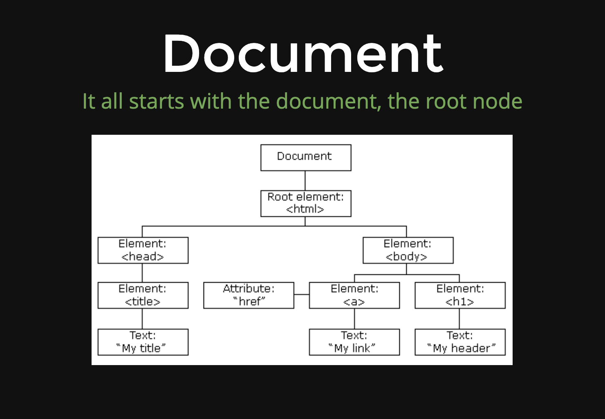

# DOM Selectors

- It all starts with the _document_, the root node
- top level object
  

## EXERCISE

- Open Console and enter following 4 lines

```js
document.URL;
document.head;
document.body;
document.links;
```

## Methods

NOTE: _Colt mistakenly refers to the array-like object that comes back from document.getElementsByClassName() as a "NodeList", when in fact it is an HTMLCollection. While they are similar, there are some differences between them. [CHECK OUT MORE ABOUT IT](https://stackoverflow.com/questions/15763358/difference-between-htmlcollection-nodelists-and-arrays-of-objects/15763707#15763707)_

**The _document_ comes with a bunch of methods for selecting elements. Here are 5 of them**

**ALL methods built into the document object**

1. document.getElementbyId()
2. document.getElementsByClassName()
3. document.getElementsbyTagName()
--NEXT TWO CAN DO SAME AS FIRST 3 using DIFFERENT SYNTAX--
4. document.querySelector() - uses css-style selectors/syntax
5. document.querySelectorAll() - uses css-style selectors/syntax

- ALL RETURN OBJECTS (even if they look like html code in console)

### getElementById
  - takes a STRING argument and returns the ONE ELEMENT with a matching ID

    ```js
    const tag = document.getElementbyId("highlight");
    ```
    
    ```html
      <body>
        <h1>Hello</h1>
        <h1>Goodbye</h1>
        <ul>
          <!-- SELECTS element with id of highlight -->
          <li id="highlight">List Item 1</li> 
          <li class="bolded">List Item 2</li>
          <li class="bolded">List Item 3</li>
        </ul>
      </body>
    ```

### getElementsByClassName
  - takes a STRING argument and returns a LIST of ELEMENTS that have a matching CLASS
  - LIST is array-like but it is actually a HTML collection (lightweight array, gives some features but cannot access all array methods (i.e. forEach))

    ```js
    const tags = document.getElementsByClassName("bolded");
    console.dir(tags[0]);
    ```
    
    ```html
      <body>
        <h1>Hello</h1>
        <h1>Goodbye</h1>
        <ul>
          <li id="highlight">List Item 1</li> 
           <!-- SELECTs both elements with class of bolded -->
          <li class="bolded">List Item 2</li>
          <li class="bolded">List Item 3</li>
        </ul>
      </body>
    ```
### getElementsByTagName 1
  - Returns a list of all elements of a given tag name, like <li> or <h1>
  - elements return as objects

    ```js
    const tags = document.getElementsByTagName("li");
    console.log(tags[0]);
    ```
    
    ```html
      <body>
        <h1>Hello</h1>
        <h1>Goodbye</h1>
        <ul>
          <!-- SELECTs all li tags -->
          <li id="highlight">List Item 1</li> 
          <li class="bolded">List Item 2</li>
          <li class="bolded">List Item 3</li>
        </ul>
      </body>
    ```
### getElementsByTagName 2
  - Returns a list of all elements of a given tag name, like <li> or <h1>

    ```js
    const tags = document.getElementsByTagName("li");
    console.log(tags[0]);
    ```
    
    ```html
      <body>
      <!-- SELECTs both h1 tags-->
        <h1>Hello</h1>
        <h1>Goodbye</h1>
        <ul>
          <li id="highlight">List Item 1</li> 
          <li class="bolded">List Item 2</li>
          <li class="bolded">List Item 3</li>
        </ul>
      </body>
    ```
### querySelector 1
  - Returns the FIRST element that matches a given CSS-style selector

    ```js
    //select by ID
    const tag = document.querySelector("#highlight");
    ```
    
    ```html
      <body>
        <h1>Hello</h1>
        <h1>Goodbye</h1>
        <ul>
          <!-- SELECTs first element with id of highlight -->
          <li id="highlight">List Item 1</li> 
          <li class="bolded">List Item 2</li>
          <li class="bolded">List Item 3</li>
        </ul>
      </body>
    ```
### querySelector 2
  - Returns the FIRST element that matches a given CSS-style selector

    ```js
    //select by CLASS
    const tag = document.querySelector(".bolded");
    ```
    
    ```html
      <body>
        <h1>Hello</h1>
        <h1>Goodbye</h1>
        <ul>
          <li id="highlight">List Item 1</li> 
      <!-- SELECTs only first element with class of bolded which is next line of code -->
          <li class="bolded">List Item 2</li>
          <li class="bolded">List Item 3</li>
        </ul>
      </body>
    ```
### querySelector 3
  - Returns the FIRST element that matches a given CSS-style selector

    ```js
    //select by tag
    const tag = document.querySelector("h1");
    ```
    
    ```html
      <body>
      <!-- SELECTs only first h1 tag containing Hello -->
        <h1>Hello</h1>
        <h1>Goodbye</h1>
        <ul>
          <li id="highlight">List Item 1</li> 
          <li class="bolded">List Item 2</li>
          <li class="bolded">List Item 3</li>
        </ul>
      </body>
    ```   
### querySelector 4
  - Returns the FIRST element that matches a given CSS-style selector

    ```js
    //select element with anchor tag inside of an li with class special
    const tag = document.querySelector("li a.special");
    ```
          
### querySelectorALL 1
  - Returns a LIST OF ELEMENTS that matches a given CSS-style selector

    ```js
    //select by tag
    const tag = document.querySelectorAll("h1");
    ```
    
    ```html
      <body>
      <!-- SELECTs both h1 tags-->
        <h1>Hello</h1>
        <h1>Goodbye</h1>
        <ul>
          <li id="highlight">List Item 1</li> 
          <li class="bolded">List Item 2</li>
          <li class="bolded">List Item 3</li>
        </ul>
      </body>
    ```

### querySelectorAll 2
  - Returns a LIST OF ELEMENTS that matches a given CSS-style selector

    ```js
    //select by CLASS
    const tag = document.querySelectorAll(".bolded");
    ```
    
    ```html
      <body>
        <h1>Hello</h1>
        <h1>Goodbye</h1>
        <ul>
          <li id="highlight">List Item 1</li> 
      <!-- SELECTs both elements with class of bolded -->
          <li class="bolded">List Item 2</li>
          <li class="bolded">List Item 3</li>
        </ul>
      </body>
    ```

#### EXERCISE

- Come up with 4 different ways to select the first <p> tag
``` html
<!DOCTYPE html>
<html>
<head>
	<title>My title</title>
</head>
<body>
  <h1>I am an h1!</h1>
  <p id="first" class="special">Hello</p>
  <p class="special">Goodbye</p>
  <p>Hi Again</p>
  <p id="last">Goodbye Again</p>
</body>
</html>
```
```js
//FIRST TWO ARE PROBABLY BEST SINCE IT HAS AN ID
const helloP = document.getElementById("first")
const helloP = document.querySelector("#first")

const helloP = document.getElementsByClassName("special")[0] 
const helloP = document.querySelector(".special")

const helloP = document.getElementsByTagName("p")[0]
const helloP = document.querySelector("p")

//could use other css selectors like the first p after the h1
const helloP = document.querySelector("h1 + p")

```