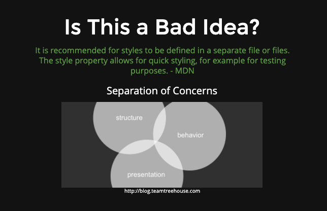

# DOM MANIPULATION

- changing an element's style
- adding/removing classes
- changing the content of a tag
- changing attributes(src, href, etc)

## STYLE
  - The Style Property is one way to Manipulate an Element's Style
  ```js
    //SELECT
    const tag = document.getElementById("highlight");

    //MANIPULATE
    tag.style.color = "blue";
    tag.style.border = "10px solid red";
    tag.style.fontSize = "70px";
    tag.style.background = "yellow";
    tag.style.marginTop = "200px";
  ```
  

**AN ALTERNATIVE**
- Rather than directly manipulating style with JS, we can define a CSS class and then toggle it on or off with JS
```js
//INSTEAD OF THIS:
const tag = document.getElementById("highlight");
tag.style.color = "blue";
tag.style.border = "10px solid red";
```
```css
/*DEFINE A CLASS IN CSS*/
.some-class {
  color: blue;
  border: 10px solid red;
}
```
```js
const tag = document.getElementById("highlight");
//ADD THE NEW CLASS TO THE SELECTED ELEMENT
tag.classList.add("some-class");
```
**classLIST**
- a read-only list that contains the clases for a given element. It is NOT AN ARRAY (cannot use push, shift, etc.)
```css
/* DEFINE A CLASS IN CSS */
.another-class {
  color: purple;
  fontSize: 76px;
}
```
```js
const tag = document.querySelector("h1")

//ADD A CLASS TO THE SELECTED ELEMENT
tag.classList.add("another-class");

//REMOVE A CLASS
tag.classList.remove("another-class");

//TOGGLE A CLASS
tag.classList.toggle("another-class");
```

## TEXT/HTML Manipulation

  **textContent**
  - Returns a STRING of all the text contained in a given element
  - text: anything between html tags but not the tags

  ```html
    <p>
      This is an <strong>awesome</strong> paragraph
    </p>  
  ```
  ```js
    //Select the <p> tag:
    const tag = document.querySelector("p");

    //Retrieve the textContent:
    tag.textContent //"This is an awesome paragraph"

    //alter the textContent:
    tag.textContent = "blah, blah, blah";

        //chain onto 
        document.querySelector("h1").textContent = "END OF THIS LESSON";

        //WILL NOT RENDER HTML
        //OVERWRITE ENTIRE BODY ON PAGE
        document.body.textContent = "<h1>GOODBYE!<h1>"; //<h1>GOODBYE!<h1> appears on page as text
  ```

  **innerHTML**
    - Similar to textContent, expcept it returns a string of all the HTML contined in a given element
    - includes tags/structure/html contained within element
    - will still overwrite everything inside if you decide to change it
  ```html
    <p>
      This is an <strong>awesome</strong> paragraph
    </p>  
  ```
  ```js
    //Select the <p> tag:
    const tag = document.querySelector("p");

    tag.innerHTML
    //"This is an <strong>awesome</strong> paragraph"

    //get all html
    document.body.innerHTML

  //WILL NOT RENDER HTML
  //OVERWRITE ENTIRE BODY ON PAGE
  document.body.innerHTML = "<h1>GOODBYE!<h1>"; //GOODBYE! |appears on page as h1  
  ```

## ATTRIBUTES
  - use _getAttribute()_ and _setAttribute()_ to read and write attributes like _src_ or _href_

  ```html
    <a href="www.google.com"> I am a link</a>
    
  ```
  ```js
    const link = document.querySelector("a");
    link.getAttribute("href"); //www.google.com
    //CHANGE HREF ATTRIBUTE
    //pass new link as second argument
    link.setAttribute("href", "http://www.dogs.com");
    //<a href="www.dogs.com">I am a link</a>

    //TO CHANGE THE IMAGE SRC
    const img = document.querySelector("img")
    //pass new source link as second argument
    img.setAttribute("src", "corgi.png");
    //
  ```

  ### GOOGLE MANIPULATION EXERCISE

  ```js
  //CHANGE GOOGLE LOGO
  const logo = document.querySelector("hplogo");
  logo.setAttribute("src", "newLogo.png")

  //CHANGE SIZE OF NEW LOGO
  logo.style.width = "200px"
  logo.style.height = "100px"
  logo.style.border - "2px solid purple"

  //SELECT A ALL A TAG and LOOP through to change all
  const links = document.getElementsByTagName("a");

  //there is no setAttribute for this (link.setAttribute)
  //CAN NOT USE FOREACH
  //GONG TO USE THIS ALOT BEFORE WE GET TO JQUERY
  for(let i = 0; i < links.length; i++){
    console.log(links[i].textContent) //prints text content of all links on page
  }

  //CHANGE STYLE
  for(let i = 0; i < links.length; i++){
    links[i].style.background = "pink"
  }
  //ANOTHER STYLE CHANGE
  for(let i = 0; i < links.length; i++){
    links[i].style.border = "1px dashed purple";
    links[i].style.color = "orange";
  }

  //CHANGE ALL HREFS
  for(let i = 0; i < links.length; i++){
    console.log(links[i].getAttribute("href")); //prints list of all the links
  }

  for(let i = 0; i < links.length; i++){
    links[i].setAttribute("href", "http://www.bing.com");
  }
  ```